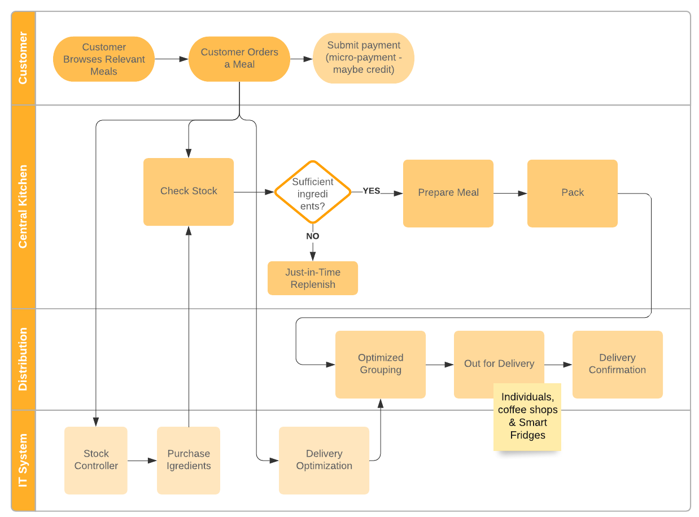
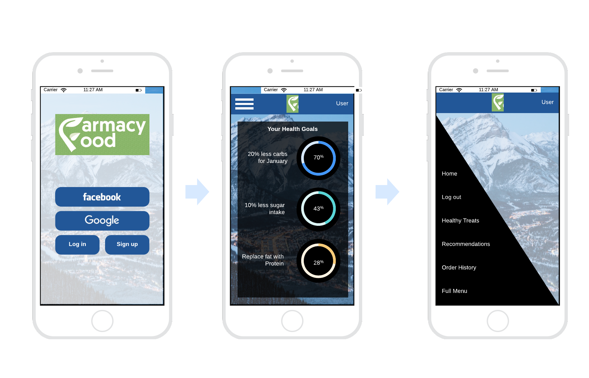
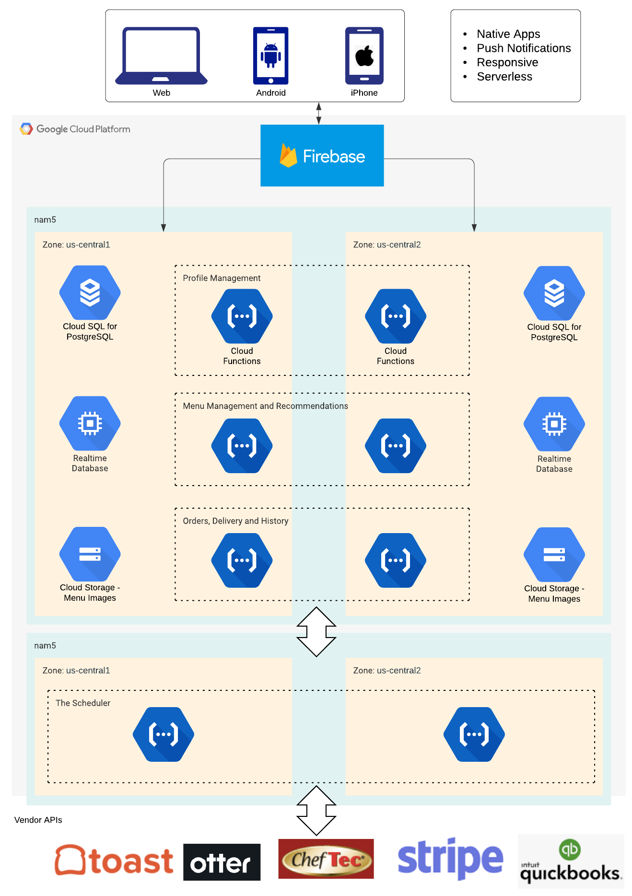

# Farmacy Food Architecture

## Table of Contents
```
I. Overview
II. Vision
III. Goals and Opportunities
  Immediate Business Goals
  Long Term Business Goals
  Business Opportunity
  Competitors
IV. Use Cases
  Customer Journey
  Case 1. Customer orders via PoS
  Case 2. Customer orders online
  Maintenance and Failure Operations
V. Requirements
  Prioritized Architecture Characteristics
    1. Viability
    2. Availability
    3. Security
    4. Extensibility
    5. Scalability
    6. Performance
  Design Constraints
VI. High-Level Architecture
  Key Development Areas
  Web/Mobile Experience
  Scheduling System
  The Missing Data Tier
VII. Milestones
  Milestone 1. Marketing and Analytics
  Milestone 2. Mobile App Menu
  Milestone 3. Mobile App Orders
  Milestone 4. Web Orders
  Milestone 5. Customer Profiles
  Milestone 6. Multi-Location and Scaling Delivery
VIII. ADRs
  ADR 1. Hosting Platform
  ADR 2. Mobile App Platform
  ADR 3. Serverless
  ADR 4. Online payment Processing System
  ADR 5. Web and Mobile Analytics
  ADR 6. Routing and scheduling Software
  ADR 7. Newsletters and Client Communication
```

## I. Overview

Farmacy Food is a healthy food startup that takes the “let food be thy medicine” quote literally. This document describes high-level architecture of Farmacy Food’s cloud-based IT infrastructure. It provides essential context followed by a list of key requirements, captured during interviews and research on the startup. A high-level architecture that satisfies those requirements is presented. The document concludes with a project breakdown in delivery milestones. This is a living document and is constantly being updated to reflect changes as the architecture evolves.

## II. Vision

We are a community casual restaurant that takes the “let food be thy medicine” quote literally. We want to make healthy meals affordable and accessible that support customers’ health and well-being.

## III. Goals and Opportunities

### Immediate Business Goals
* Make food that is delicious, healthy, nutritionally dense
* Scale operations to enable dozens of automated fridges. Handle 1000s of customers.
* Expand to apartment buildings, college campuses, hospitals, and within businesses
* Scale from City of Detroit to other geographies (Michigan, Ohio, Illinois and nationwide)
* Retain profitability and margins
* Branding; Secure, Affordable and Delivers
* Don’t make any health claims and focus on dietary needs instead
* Donate and support health care workers, senior citizens, and so on and so forth. Support partnership non-profit organizations. We shifted to basically just creating free meals for frontline workers, low-income folks, and folks that were in care in Detroit
* Engage customers with health education and marketing

### Long Term Business Goals

* Loyalty programs and community engagement
* Be able to collect health screening information from hospitals or physicians (HIPAA compliance)
* Donate money toward paying for a group of people, either a named or unnamed group e.g. feed everybody in the neighborhood altruistically.
* Build an ecosystem of preventative health interventions. Offer customers an initial sizable discount and get a referral fee from gyms, yoga studios, massage therapists, life coaches, et cetera
* Support smartwatches and health trackers
* Potentially become a platform for healthy foods. Enable chefs to create recipes within certain parameters.
* Expand to Children’s meals

### Business Opportunity

* Large market: 18 to 65, young professionals, often dealing with specific health challenges such as high blood pressure, diabetes, et cetera
* Immediately profitable: Most customers pay 12 bucks. It costs an average of $4.25 to produce, package and distribute our meals
* Low setup costs: Able to open up a location for an average of $7,000 comparison to the $500,000 to a million dollars for a restaurant
* Currently 400 meals a week. Between 1,500 to 2,000 meals a week by December
* Six to eight locations before the end of 2020
* 1,000 dedicated customers in early 2021. 10% of them subscription customers. The average meal subscription customer buys 10 meals a week (two meals per weekday)

### Competitors

Any food and beverage-based or restaurant-based business is a competitor. Direct competitors in Detroit are places like Chopped, Seven Grains, Freshy, or Sweetgreen on a national basis.

## IV. Use Cases

In order to understand the main requirements we have to follow an order from the customer till the meal reaches their door.

### Customer Journey

These interactions happen after successful acquisition of a customer. Customer acquisition is not covered by this document.

The following _customer_, and _delivery_ interactions might happen either via web or mobile app. SMS interactions might be supported in the future.



### Case 1. Customer orders via PoS

* The _customer_ visits the point of sales
* The _customer_ picks a meal from the fridge
* The _PoS owner_ charges _customer_’s card and prints an invoice
* The PoS informs the _scheduling system_ for the reduction of stock
* The _scheduling system_ triggers a replenish order if the stock is low
* The PoS informs the _accounting system_ on the sale

### Case 2. Customer orders online 

* The _customer_ must set-up an account (Including social sign-in Facebook, Gmail, etc.)
* The _customer_ must be logged in
* The _customer_ must set dietary preferences and set health goals
* The _customer_ must be shown available delivery options near an area of their choice (e.g. home or work). The delivery options are  home delivery (small delivery fee) and collection from a smart fridge (free). Both are subject to availability in supported locations
* The _customer_ must choose a delivery method
* The _customer_ must be shown time-options for delivery or pick-up. This could be either ASAP where a time must be provided subject to _centralized kitchen_ and _delivery_‘s availability, or scheduled, where the _customer_ can be offered more flexibility for a later time
* The _customer_ searches for available meals compatible with his preferences and available on the given timeframe
* The _customer_ adds meals to his basket
* The _customer_ must have sufficient credit, or a coupon
* The _customer_ must be able to purchase their credit if necessary
* The _customer_ must be able to confirm discount eligibility during the purchase
* The _customer_ must be presented and order summary and confirm the order
* A confirmation SMS is sent to the _customer_
* An invoice is sent by email to the _customer_, via the _accounting system_
* The order is scheduled by the _scheduling system_
* The _scheduling system_ informs the _stock controller_ system for the order and the timeframe
* The _stock controller_ system will issue purchase orders if the stock of any ingredients is low
* The _stock controller_ informs the _accounting system_ of the purchase to update the P&L
* The _scheduling system_ informs the _delivery_ system for the order and the timeframe
* The dish or its ingredients aren’t relevant at this stage. Metadata about the order (e.g. cold or warm dish) is sent to the _delivery_ system
* The _delivery_ system schedules delivery and returns a tracking identifier and a container identifier
* At the appropriate time, the order is presented to the _centralized kitchen_
* The meal is prepared using the ingredients by the _centralized kitchen_
* The meal is marked as ready on the _centralized kitchen_ dashboard
* The meal is placed on the appropriate container by the _centralized kitchen_
* The _delivery_ picks the container and travels to the specified location
* In case it’s home delivery
  * The _delivery_ gives the customer the order and marks the order as complete by scanning the QR code
  * The _customer_ receives a confirmation SMS
* In case of _smart fridge_ delivery
  * The _delivery_ replenishes the _smart fridge_ placing orders on the designated cells
  * The _delivery_ marks the order as complete by scanning the QR code. The _customer_ receives a notification SMS to pick-up their order
  * The _customer_ swipes a credit or debit card they’ve registered in the app, on the back-end of the _smart fridge_
  * The _smart fridge_ releases the order
  * The _customer_ receives a confirmation SMS.
* After a specified interval (a day) the _customer_ is sent a feedback email
* Engage the _customer_ by pushing marketing and health education messages

### Maintenance and Failure Operations

* Emergency Stock. The _stock controller_ must ensure there’s always enough safety stock to support the _kitchen_.
* Clean the smart fridges. Leftover orders must be returned by the _smart fridge_ operator (e.g. coffee shop). The _delivery_ must be notified via a web/mobile form to pick those up
* Accidents e.g. spills on the fridge must be reported by the _smart fridge_ operator via a web/mobile form. Power outages must be monitored and when prolonged, the food/orders should be considered expired.
* The _customer_ might not receive an order. In case of home delivery, this might happen because the _delivery_ was late or unavailable or any other reason. The _customer_ must be able to dispute the order and get a refund. In case of _smart fridge_ delivery this might happen either due to _delivery_ problems (same as before) or because the fridge is jammed, non-operational, there’s a power outage or the operator is unavailable (e.g. store is closed), Aggregate stats must be collected in both cases and reported to the _management_.
* The _customer_ might complain about the quality of the order such as meal quality, temperature, quality of cooking, delivery etc. The _management_ is required to follow up in those cases with the goal to retain the customer and improve the process.
* The _kitchen_ might run out of stock or lag behind or be unable to deliver on time for any other reasons. Detailed metrics must be collected and communicated to the _management_ in real time. The _management_ can decide to issue a refund or take other actions to mitigate the issue.
* The _stock controller_ might be unable to purchase ingredients on a price that gives acceptable margin. It must notify the _management_ in order to monitor the situation and take actions such as mark meals as unavailable or provide alternative ingredients.

## V. Requirements

The architecture must support the use cases described above while satisfying the requirements listed in this section.

### Prioritized Architecture Characteristics

#### 1. Viability
The startup must be able to implement the architecture given budget and time constraints. More specifically this is framed as an integration project where solutions from Software as a Service (SaaS) vendors are integrated using minimal software development. The architecture must be able to be built by delivering features that address the most immediate growth pain points of the business. Complex features that require custom software development must be postponed to as late as possible. 
#### 2. Availability
This is a business critical system and this reflects on the Service-Level Objectives (SLOs). The system must be available during core business hours and the website has to be continuously available with the exception of small (up to 2 hours) maintenance windows during low traffic times.
#### 3. Security
The design must be secure to protect the brand. To have both high security and low costs we must limit the attack surface and avoid holding consumer and sensitive data. Data to be considered include credit card numbers, dates of birth, addresses and emails. Health data is sensitive data and should also be carefully considered. Consulting should be used to ensure compliance with regulatory requirements e.g. PCI for credit cards or HIPAA for health data. The SaaS vendors must also be reputable and provide security assurances.
#### 4. Extensibility
The design must be able to grow as the startup grows. It’s expected that Farmacy Food will pivot several times as it grows. Pivoting should be driven by business needs and not be influenced by rigid architecture structures. In particular architectures that require heavy upfront investment in hardware or software or long-term licencing should be avoided if possible. Careful documentation of processes, requirements and architectural decisions, must make a complete rewrite of every software component, a viable option.
#### 5. Scalability
Scalability requirements are moderate. The architecture needs to be able to support 1000s  of users. This is a subsequent requirement for all our SaaS vendors. They should provide assurances of scale and explain how they monitor and stress test their infrastructure. 
#### 6. Performance
Customer interactions must be timely to provide a smooth customer experience. This means less than a second for most operations. In exceptional cases where more time is indeed a progress indicator and other interactive components must be used to provide a smooth User Experience (UX). All other (non-customer) interactions should be responsive enough to support operations, but it’s acceptable to be less responsive than the user interactions.

### Design Constraints
* [ChefTec](https://www.cheftec.com/cheftec-basic) is used for Restaurant Inventory Management & Purchasing
* [Toast](https://pos.toasttab.com/) is used as Point of Sales solution
* [Intuit QuickBooks](https://quickbooks.intuit.com/) is used for accounting
* There’s an existing mobile application

ChefTec doesn’t have any public available information about their API. Given that most of their off-the-shelf solutions cost in the order of serveral thousand dollars, its [consultancy services](https://www.cheftec.com/consultancy) is unlikely to be cheap. This is a significant risk given how important the central kitchen is for Farmacy Food. ChefTec integrates with QuickBooks for invoicing through add-ons for extra cost.

Toast has an API that one can access after accepting their “API Documentation License Agreement”, [here](https://dev.toasttab.com/Ie5QH/apiOverview.html).

QuickBooks has an elaborate [API](https://developer.intuit.com/app/developer/qbo/docs/develop) and SDKs.

## VI. High-Level Architecture

Directly out of the basic listing of the requirements, and by taking the ADRs into account, this high-level diagram can provide all the necessary use cases.


The architecture is obviously very customer-centric. The customer interacts with Farmacy Food through well designed touch-points. Those are the:

* Cross-platform web and mobile apps
* Point of Sales Devices on stores
* Smart Fridges also on stores
* Web Campaigns that educate and engage

The kitchen is already familiar and satisfied with their ChefTec solution. As long as an API integration solution is found, ChefTec can integrate with the rest of the system. Their [backup mechanism](https://www.cheftec.com/backup) can be another way to export data. If these don't work, import/export and manual operations will be required. As the startup scales, it’s likely that this will become a friction point that will make Farmacy Food investigate ChefTec alternatives.

Management oversees operations with emphasis on Marketing and Analytics. This is to be expected for a startup in growth mode. On the other hand, back-end operations are automated to a great extent and don’t require management involvement.

QuickBooks takes care of accounting and payroll. It is integrated with ChefTec and the Toast PoS. The online payments must also be integrated with QuickBooks by using the [relevant app](https://quickbooks.intuit.com/app/apps/appdetails/?shortName=stripe&).

### Key Development Areas

This Architecture uses SaaS vendors for most of the mundane aspects of the system. This allows the development team to focus on developing the differentiating factors of Farmacy Food. Those are:

#### Web/Mobile Experience

The web/mobile experience is the most important differentiating factor of the brand. This allows the customers to order online according to their dietary and health requirements. By using React Native and Firebase, we avoid spending development time on mundane tasks like login and cross-platform mobile development. The development team can focus on the development of value-adding online functionality and seamless UX.



On the back-end the serverless choice of Cloud Functions means that the team won’t have to worry about building, securing and maintaining servers [[1](https://cloud.google.com/blog/products/serverless/how-gannett-built-a-serverless-app), [2](https://itnext.io/building-a-serverless-restful-api-with-cloud-functions-firestore-and-express-f917a305d4e6)].



[The `nam5` Multi-Regional location](https://firebase.google.com/docs/projects/locations) will be used to allow redundancy of critical data and high availability. Replication is handled by Firebase. For the storage and data synchronization needs of the application the [Realtime Database](https://firebase.google.com/docs/database) will be used based on the [best practices for Farmacy Food's needs](https://firebase.google.com/docs/database/rtdb-vs-firestore).

#### Scheduling System

The Scheduling System is a central point where we collect all the (potentially complex) business logic for dispatching and scheduling orders. As described in the use cases, there are complex questions like meal availability that require input from the scheduling system. The options available to a customer for a given time-window can be limited by the availability of delivery or the kitchen and ingredients. The complex logic that is able to answer those questions is included in the Scheduling System. The same system manages order-dispatch from the Web/Mobile UIs to ChefTec and Otter for delivery. This system is responsible with using the APIs of the SaaS platforms to gather information and coordinate their operation.

#### The Missing Data Tier

In a traditional 3-Tier Architecture we would have presentation, application and data tiers. In Farmacy Food Architecture, the presentation tier consists of Firebase and the web apps. The application tier is mostly the scheduling system. The data tier seems to be missing though. The fact is that state is stored in various places on the SaaS platforms like Toast and ChefTec. Their APIs must be able to provide the data we need in a timely manner. Remember that our user interactions require sub-second responses. There will be cases where APIs will be missing and/or will be slow. In these cases explicit data storage will be required. Duplicate state inevitably will be out of sync. This means that consolidation operations will be required (see [Saga distributed transactions](https://docs.microsoft.com/en-us/azure/architecture/reference-architectures/saga/saga)). This will increase the complexity of the system and as such, it must be delayed as long as possible. A level of redundancy to business acceptable levels can be employed. For example 5% more meals can be prepared in order to offset mistakes from out-of sync state. Inevitably some customer interactions will be less than perfect because of that. State synchronization errors will manifest as errors on API calls. Alarm and monitoring provided by the GCP must be set-up properly to allow the developers and management to assess the types of errors that occur. All these problems will start happening at a certain level of traffic. We can delay spending development time addressing those issues unless there’s a certain level of success.

Key takeaways:

* Not having a data tier is an artifact of the massive development cost savings by employing SaaS services.
* At a certain level caching or data duplication will be required. This will result in occasional failures.
* Failures must be monitored. Those failures must be addressed at business level with great customer support.
* When the scale of the success is such that certain types of failures become significant, fixing those will require explicit development effort. This will happen with focused projects that will pay for themselves in the form of savings and increased customer satisfaction. Those projects will likely require the collaboration of SaaS vendors who will be willing to help given that farmacy food is a significant revenue stream for them. If SaaS vendors aren’t responsive and prevent those errors from getting fixed, alternatives must be explored or the functionality might be re-implemented in house.

## VII. Milestones

### Milestone 1. Marketing and Analytics
* The existing Web and Mobile apps will be enhanced with Google Analytics
* The Web and Mobile apps will be collecting emails of leads and customers
* Any existing e-mails will be migrated to MailChimp
* Education on healthy eating newsletters will engage the customers. Their performance will be evaluated with Analytics
* Glue logic Cloud Function will be developed that keeps MailChimp user database in-sync with the Web App.

### Milestone 2. Mobile App Menu
* The existing Mobile app will be enhanced to show the menu with information of availability based on the kitchen and the location.

### Milestone 3. Mobile App Orders
* Customers are able to login (Firebase takes care of social login) and build basic profiles
* Customers can add credit by using the Stripe integration
* Customers can place orders of meals via their mobile app
* Orders are scheduled using ChefTec
* Smart fridges are forwarded sufficient information to release meals in a secure manner (hashes of credit card numbers)

### Milestone 4. Web Orders
* The website is enhanced to be on-parity with the mobile app

### Milestone 5. Customer Profiles
* The customers can build rich profiles through the web and mobile apps
* The available and recommended meals will be customized based on their profiles
* The customers can track records based on meals e.g. calories avoided compared to traditional dining

### Milestone 6. Multi-Location and Scaling Delivery
* The web and mobile apps are enhanced to support multiple cities
* Otter delivery is integrated to enable enhanced delivery scheduling from the centralized kitchen
* Multiple local kitchens on a trial-basis are supported

## VIII. ADRs

#### ADR 1. Hosting Platform
Status: proposed
Context: The architecture needs to be hosted either on dedicated servers or in the cloud. The choice of cloud provider affects the cost of the solution and the time of the implementation.
Decision: The platform of choice is the [Google Cloud Platform](https://cloud.google.com/) (GCP) on the basis of ease of development, security, versatility and price. To avoid vendor lock-in, no components that don’t have an AWS-equivalent should be used without explicit permission.
Consequences: The implementation is expected to scale elastically on demand. We can run experiments and develop staging and test environments easily. AWS remains a migration option if factors like host dictate it at some point. Notably, Google App Engine and BigQuery can _not_ be used because of vendor lock-in concerns.

#### ADR 2. Mobile App Platform
* Status: Proposed
* Context: The existing mobile application will need to be revamped to enable further use cases.
* Decision: [Google Firebase](https://firebase.google.com/) will be used to support. [It’s a more mature framework](https://www.mitrais.com/news-updates/aws-amplify-vs-google-firebase-which-is-better/) compared to the alternative AWS Amplify. [React Native](https://rnfirebase.io/) will be used for [cross-platform app development](https://www.polidea.com/blog/react-native-vs-native-app-developmentpros-and-cons-for-business/). This enables us to have one app instead of one for each platform. React Native is a mature technology developed by Facebook.
* Consequences: The contractors that will be developing the app should be experts on those technologies. Given that they’re the two most widely supported, through competitive bidding, this is expected to reduce development and maintenance costs.

#### ADR 3. Serverless
* Status: proposed
* Context: Since traffic isn’t an issue, we can reduce hosting costs by running software in Virtual Machines in GCP (Compute Engine). This means that we will be responsible for building machines and operating them. We can install explicitly RabbitMQ/Kafka, Databases like PostgreSQL and business logic as well as front-end servers (nginx, custom code). On the other hand we could use serverless technologies.
* Decision: Building virtual machines and self-hosting means that the developers will have to spend time maintaining and operating machines. That cost is significant and will slow down development time, since soon a fraction of developer’s time will need to be spent in KTLO. This isn’t a good investment of developers’ time on a startup. As such, Serverless technologies will be used, which are more expensive in terms of hosting, but are managed entirely by Google. Security is also then Google’s responsibility which reduces the attack surface we’re responsible for, under the [shared responsibility model](https://medium.com/cloudadventure/demystifying-gcp-security-responsibilities-44c0ae3a3826).
* Consequences: As part of ADR 1, we decided that only technologies that also exist in AWS will be used. [Google Functions](https://firebase.google.com/docs/functions) will be used for business logic and the equivalent is AWS lambda. Both Python and JavaScript can be used for implementation in both platforms. Care must be taken to avoid using low-level PaaS APIs that would bind the implementation to the platform too much. Appropriate interfaces, owned by us, must abstract PaaS artifacts. [Cloud Pub/Sub](https://cloud.google.com/pubsub/docs/overview) will be used for queues and the equivalent is AWS SQS. For databases [Cloud SQL for PostgreSQL](https://cloud.google.com/sql/docs/postgres) will be used and the equivalent is Amazon RDS for PostgreSQL. Application load balancers and other low-level network artifacts can also be used because they exist in both platforms.

#### ADR 4. Online payment Processing System
* Status: Proposed
* Context: Beyond the PoS, we now need to process payments online (both in web and mobile) but we don’t want the hassle and regulatory requirements of management of sensitive customer data like credit card numbers. Our branding efforts require use to be a secure platform. We can’t afford information breaches or fraud.
* Decision: [Stripe](https://stripe.com/) is a suite of payment APIs that enables businesses to manage revenue, prevent fraud, and expand internationally. Beyond the [web](https://stripe.com/docs/payments?payments=popular), it can be [integrated with Google’s Firebase](https://firebase.google.com/docs/use-cases/payments) mobile framework to receive payments from both iOS and Android devices. It has a rating of [931/950](https://www.upguard.com/security-report/stripe) from UpGuard while PayPal has [912/950](https://www.upguard.com/security-report/paypal). Only [phishing attacks](https://www.bleepingcomputer.com/news/security/stripe-users-targeted-in-phishing-attack-that-steals-banking-info/) have been reported for Stripe while PayPal has [data breaches](https://www.trendmicro.com/vinfo/es/security/news/cybercrime-and-digital-threats/paypal-reports-data-breach-affects-1-6-m-tio-customers).
* Consequences: The [Stripe API](https://stripe.com/docs/api) is a REST API and it’s straightforward. There’s the need to redirect the customer to Stripe Checkout. The keys should be [kept safe](https://stripe.com/docs/keys#safe-keys). SSL certificates should be checked while making API calls and only [whitelisted IPs](https://stripe.com/docs/ips#ips) should be trusted. [Integration security guide](https://stripe.com/docs/security/guide#setting-up-tls) must be followed. All communication should be verified with Stripe’s [PGP key](https://stripe.com/docs/security/pgp-key).

#### ADR 5. Web and Mobile Analytics
* Status: Proposed
* Context: In order to grow the customer base and measure the effectiveness of marketing spending, we need to capture key metrics about our customer’s journey through our web and mobile assets.
* Decision: [Google Analytics](https://analytics.google.com/) is the de facto platform for online analytics that supports both [web](https://developers.google.com/analytics/devguides/collection/gtagjs), [mobile](https://developers.google.com/analytics/devguides/collection/firebase/android) and [connected devices](https://developers.google.com/analytics/devguides/collection/protocol) analytics. Since we don’t treat this analytics information as sensitive or intellectual property data, we can trust Google for the collection, analysis and presentation. They are free, well integrated with their advertising platform and marketing agencies know how to use it. Several alternatives we examined, including Kissmetrics, Heap and GoSquared, often lack significant features, have more difficult or missing API integrations for mobile and they aren’t free.
* Consequences: We have to [integrate](https://medium.com/@ayushi.nig/google-analytics-for-react-native-app-ba03140ed528) Google Analytics with our React Native App early, to allow us to build baselines for our traffic and track errors during the development process.

#### ADR 6. Routing and scheduling Software
* Status: Proposed
* Context: In order to scale delivery both at home and on the smart fridges, we need a delivery optimization and scheduling system.
* Decision: [Otter](https://www.tryotter.com/) will be used as a starting point for delivery optimization, on the basis of very quick integration, since it already supports Toast as part of its [integrations](https://www.tryotter.com/integrations). It also supports Uber Eats, Caviar and Postmates for ordering. Alternatives like [OptimoRoute](https://optimoroute.com/business-type/food-delivery/) or [Circuit](https://getcircuit.com/) can be employed when scale proves to be a problem.
* Consequences: The direct integration means that we have limited access and flexibility.

#### ADR 7. Newsletters and Client Communication
* Status: Proposed
* Context: We need to engage customers with health education. This must be driven by business and must be mails with rich content including images.
* Decision: [MailChimp](https://mailchimp.com/) is chosen as a customer communication platform on the basis of credibility, pricing and ease of use from non-technical users. For rich SMS interactions, [Twilio](https://www.twilio.com/messaging) will, where necessary, be used on the basis of credibility, reliability and affordability.
* Consequences: The lists of Mailchimp must be synchronized with the rest of the system.
